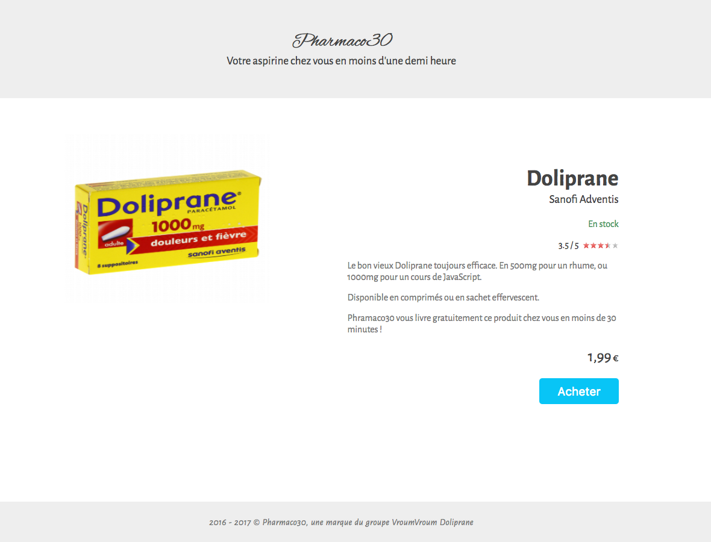

# Challenge S6-J4
Intitulé : **SEO**  
https://github.com/O-clock-Explorer/challenge-seo-GuillaumeD84

Guillaume DURAND  
Promo : Explorer  
S6-J5 | 10/11/2017

Formateur : Maxime  
Type : SEO

## Objectif
Réaliser intégration optimisée pour le référencement ! Ajouter des métadonnées avec les microdatas pour obtenir sur Google un "Rich snippet" produit.

